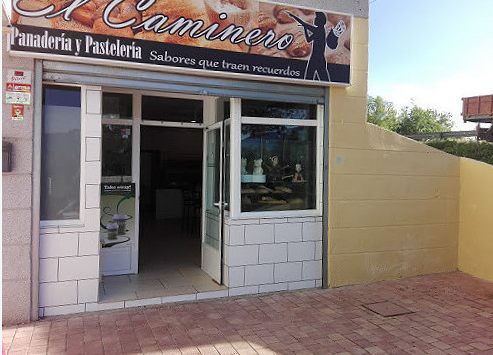
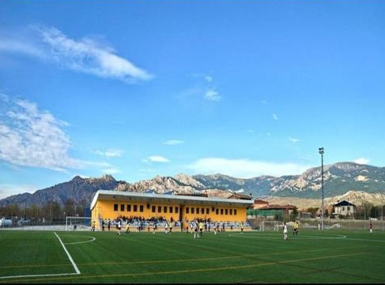

# python
GM2

# MI PRESENTACIÓN

**HOLA ESTA ES UNA PEQUEÑA INTRODUCCIÓN A MI PERSONA**

## Hola, soy Aarón, tengo 17 años, trabajo de panadero en una tienda llama "El caminero", suelo trabajar solo los findes por las mañanas, salvo los días que tengo partido de fútbol, que mi tía, que también es mi jefa, me deja saltarme el día de trabajo para poder ir a jugar. También me han dicho de ser segundo entrenador de un equipo de fútbol, el cual, entrena, como primer entrenador, mi tío.

[Visita "El Caminero"](https://panaderiaelcaminero.es/)

### He trabajado y estudiado esto:

-Panadero.
-Entrenador de fútbol.
-ESO.
-Primaria.
-1er año grado medio de "Redes locales y sistemas microinformáticos".

### Mis metas en la vida:

- [X] Entrenar con un equipo profesional de fútbol.
- [X] Que me llame mi equipo favorito de fútbol para ofrecerme un contrato profesional.
- [ ] Tirarme en paracaidas.
- [ ] Tener mi casa propia.
- [ ] Casarme.
- [ ] Tener mi familia.
